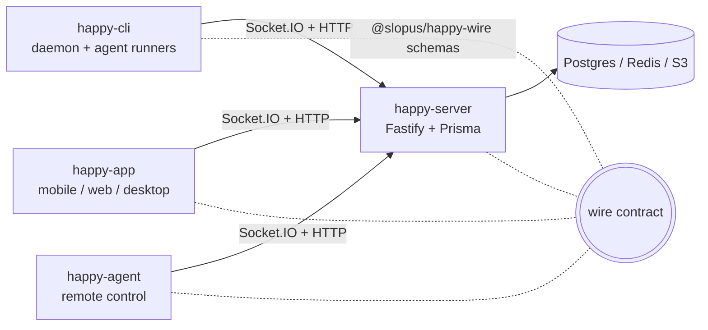

# Monorepo Overview

Top-level orientation for the Happy monorepo: what the packages are, how they fit together, and
the cross-cutting facts you need before working in more than one of them. For subsystem detail,
follow the links into the rest of `docs/` and the per-package guides.

Happy is a mobile/web/desktop client for **Claude Code and Codex** with end-to-end encryption.
You run `happy claude` / `happy codex` on your machine instead of the bare agent; the CLI wraps
the session and can hand it off to a phone or browser and back. User content is encrypted on the
device — the server only ever sees opaque ciphertext.

## Package manager

This is a **pnpm workspace** (`pnpm@10.11.0`). Use pnpm, not npm or yarn. Some package READMEs
still show `yarn workspace …` examples, but the root scripts and CI use pnpm filters.

## Packages

The package **directory** differs from the published **name** in several cases, and
`pnpm --filter` takes the *name*:

| Directory                  | Package name               | Role                                                                 |
|----------------------------|----------------------------|----------------------------------------------------------------------|
| `packages/happy-cli`       | `happy`                    | The `happy` CLI + daemon — wraps Claude Code/Codex, runs sessions    |
| `packages/happy-app`       | `happy-app`                | Expo (React Native) mobile/web client + Tauri macOS desktop          |
| `packages/happy-server`    | `happy-server-self-host`   | Fastify + Prisma backend for encrypted sync; bundles the web app     |
| `packages/happy-agent`     | `happy-agent`              | Headless CLI to *control* agents remotely (list/spawn/send/monitor)  |
| `packages/happy-wire`      | `@slopus/happy-wire`       | Shared wire types + Zod schemas — the protocol contract              |
| `packages/happy-app-logs`  | `happy-app-logs`           | Tiny dev log-collection server                                       |
| `packages/codium`          | `codium`                   | Electron experiment (electron-vite + React 19)                       |

`happy-cli`, `happy-app`, and `happy-server` each carry their own `CLAUDE.md` with the
package-specific style rules and gotchas (i18n, Unistyles, Prisma/transactions, the daemon).

## How the pieces connect



- The server stores user content (session metadata, agent state, messages, artifacts, KV) as
  **opaque encrypted blobs**. It only decrypts *service tokens* (GitHub/OpenAI/Anthropic/Gemini)
  using a KeyTree derived from `HANDY_MASTER_SECRET`. See [encryption.md](encryption.md) and
  [backend-architecture.md](backend-architecture.md).
- Realtime uses Socket.IO with three connection scopes — `user-scoped`, `session-scoped`,
  `machine-scoped`. Persistent `update` events are DB-backed with a per-user monotonic `seq`;
  presence (`*-alive`) events are ephemeral. See [realtime-sync-and-rpc.md](realtime-sync-and-rpc.md).
- The CLI **daemon** runs sessions in the background and exposes a local control server on
  `127.0.0.1`. Mobile/web drive local actions (bash, file read/write, ripgrep, difftastic,
  spawn-session) over **RPC through Socket.IO** — there is no broad REST surface for that. See
  [cli-architecture.md](cli-architecture.md).

## Why `@slopus/happy-wire` is the keystone

`happy-wire` is tiny (deps: just `zod` and `@paralleldrive/cuid2`) and holds no business logic.
Its value is entirely in *where it sits*: it is the single place four independently-released
clients agree on the protocol. The CLI ships on npm, the app goes through App Store review, the
server deploys on its own cadence, and the agent is a separate npm package — without one shared
schema package the wire format lives implicitly in four codebases and drifts. Centralizing it
turns drift into a compile error instead of a production mystery.

What makes that pay off, beyond "don't repeat the types":

- **One definition yields runtime validation *and* static types.** Because the schemas are Zod,
  every consumer gets both `safeParse` and an inferred TypeScript type from the same source. This
  matters specifically because of the encryption boundary: the server only ever sees
  `{ t: 'encrypted', c: '<base64>' }` and *cannot* validate content. Validation has to happen on
  the clients, after they decrypt, against untrusted bytes — so a `safeParse` at that boundary is
  the thing standing between a malformed or hostile payload and a crash.
- **Cross-field invariants travel with the schema.** `sessionEnvelopeSchema`'s `superRefine`
  encodes rules like "`service` / `start` / `stop` events must have `role: 'agent'`" and
  "`subagent` must be a valid cuid2." Every consumer inherits those for free instead of
  re-implementing (and disagreeing about) them.
- **Protocol evolution stays survivable.** The legacy format (`role: 'user' | 'agent'`) and the
  modern session protocol (`role: 'session'`) coexist in one discriminated union, alongside
  compatibility aliases (e.g. `ApiMessageSchema → SessionMessageSchema`). The change policy is
  additive-only, and discriminator (`t`) values are treated as protocol API — never renamed. That
  contract is what lets old app builds, which linger on phones for months, keep talking to a newer
  server.

**The cost** is a build-order dependency (see below): shipping this as a real published package
rather than a shared TS path means dependents import from `dist/*`. For a four-client,
E2E-encrypted system that trade is clearly worth it; for a single app it would be over-engineering.

Schema inventory, the legacy-vs-modern payload shapes, and the migration history live in
[happy-wire.md](happy-wire.md) and `packages/happy-wire/README.md`.

## Build-order gotcha

Consumers import `@slopus/happy-wire` through package exports that point at `dist/*`, so on a
**clean checkout build wire first** before typechecking or building dependents:

```bash
pnpm install
pnpm --filter @slopus/happy-wire build
```

## Common commands

Per-package work uses filters (from repo root):

```bash
pnpm --filter happy build                              # build the CLI
pnpm --filter happy test                               # CLI unit tests (vitest)
pnpm --filter happy-app typecheck                      # app type-check (CI gate for the app)
pnpm --filter happy-app web                            # run the web app
pnpm --filter happy-server-self-host standalone:dev    # run server locally (PGlite, no Docker)
pnpm --filter happy-server-self-host test
```

Root convenience scripts:

```bash
pnpm cli      # run the CLI       (= pnpm --filter happy cli)
pnpm web      # run the web app   (= pnpm --filter happy-app web)
pnpm release  # interactive: pick a publishable package and release it
```

There is **no repo-wide test or build command** — typecheck/test/build are per-package
(`tsc --noEmit` + `vitest` throughout). CI runs two gates: `happy-app typecheck`
(`.github/workflows/typecheck.yml`) and a CLI/server smoke test
(`.github/workflows/cli-smoke-test.yml`).

## Local dev: the `env:*` environment manager

`environments/environments.ts` (driven by `pnpm env:*`) creates **isolated local environments**
under `environments/data/envs/<name>/`, each with its own `HAPPY_HOME_DIR`, `HAPPY_SERVER_URL`,
`HAPPY_WEBAPP_URL`, `HAPPY_PROJECT_DIR`, ports, and a copied lab-rat fixture project. This is the
intended way to run the full stack locally end-to-end.

```bash
pnpm env:new <name>     # create an isolated env
pnpm env:use <name>     # switch the current env
pnpm env:server         # run server in the current env
pnpm env:web            # run web app in the current env
pnpm env:cli <args...>  # passthrough: runs `happy <args>` with the current env applied
```

See [dev-environments.md](dev-environments.md). For the server alone, standalone mode
(`pnpm --filter happy-server-self-host standalone:dev`) uses embedded Postgres (PGlite) and needs
no Docker/Redis.

## Conventions that apply across packages

- TypeScript, strict mode, **4-space indentation** across the TS packages.
- `@/` path alias maps to each package's source root (`./sources/*` or `./src/*`).
- All imports at the top of the file — never import mid-code.
- Validate external input with **Zod**; encryption uses libsodium (app) / TweetNaCl + AES-256-GCM
  (CLI/agent) — never weaken the encryption boundary.
- **Never write Prisma migrations yourself** (server) — humans do migrations; you may run
  `pnpm --filter happy-server-self-host generate` to regenerate the client.
